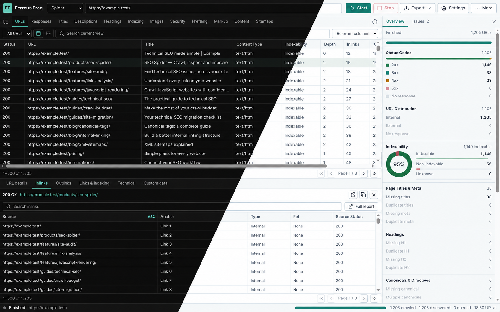

# Ferrous Frog SEO Spider

*It used to croak. Now it compiles.*



<p align="center"><sub>Dark and light themes · Sample crawl data · <a href="docs/images/workspace-dark.png">Dark screenshot</a> · <a href="docs/images/workspace-light.png">Light screenshot</a></sub></p>

Ferrous Frog is a clean-room desktop SEO crawler built with Rust and Tauri. It crawls websites like a search-engine bot, captures technical and on-page SEO signals, runs audit rules, and presents the results in a fast, filterable desktop UI.

## Status

This repository contains a working crawler with several partially implemented advanced features. See the [verified feature comparison and remaining gaps](docs/FEATURE_COMPARISON.md) before treating a roadmap item as full feature parity.

Recent workflow and correctness repairs:

- Direct Settings access and keyboard crawl submission, recoverable empty filters, readable secondary text in both themes, and a compact layout down to the minimum desktop window size.
- Compact workbench with category tabs, 28-pixel virtualized rows, an optional audit tree, a fixed bottom URL inspector and right-side Overview/Issues tabs. Progress lives in the status bar.
- URL columns stay visible during horizontal scrolling in wide grids. The inspector has keyboard-accessible URL details, Inlinks, Outlinks, Links & indexing, Technical and Custom data tabs.
- Dismissible errors and notifications appear inside the active dialog. Whole-crawl exports remain available when the current filter has no results.
- Categories initially show all URLs with relevant columns; their filter dropdown narrows to a specific check. The complete audit tree and all-columns option remain available.
- Inline inlinks/outlinks use bounded server-side pages, search and sorting. Selection changes reset paging and discard old requests; live refresh waits for each request to finish, and failed queries can be retried. Full link, anchor-text, redirect and sitemap-validation reports remain available.
- The Issues inspector lists checks with positive summary counts and opens their result filters. Counts can overlap and cover the available crawl summary, not every engine audit.
- Live duplicate filters use storage queries; stale query responses cannot overwrite newer filters.
- Switching crawl datasets clears old URL details and progress; fatal crawl errors restore the Start control.
- Per-origin robots rules and shared request spacing cover redirects and sitemap HTTP requests.
- Failed pages and non-HTML resources no longer inflate missing metadata audits; robots exclusions are separate from broken requests in results and reports.
- HTTP errors retain non-indexable status, and generic robots directives apply to repeated meta/header fields and non-HTML responses.

Existing capabilities:

- Cargo workspace with engine crates.
- Tauri 2 desktop shell.
- A splash window shares the saved System/Light/Dark appearance and opens the workspace after its first results query settles. Failed queries remain visible in the workspace; a 12-second fallback reveals the main window if startup never signals readiness.
- More > Quit and native window/app exit requests use a Yes/No confirmation. No or Escape cancels; Yes waits for crawl cancellation and final frontier saving before exiting. Unsaved memory results are called out even when the current filter is empty.
- React, TypeScript, and Vite frontend.
- In-memory crawl result store.
- SQLite-backed database mode with resumable current-crawl storage, including queued URLs, the seen set, and scheduler progress.
- Crash recovery status for persisted database frontier state, with automatic resume enablement when queued crawl work is detected.
- SQLite-backed named crawl sessions with per-session database files and reopen/delete controls.
- SQLite-backed named configuration profiles with save/load/delete controls.
- Automatic local saving of the last crawl configuration, storage mode, and resume preference. Reopening restores these settings without selecting a profile; malformed settings fall back to safe defaults, and storage failures show a warning while leaving the current session usable. Crawl results and credentials are not included in this snapshot.
- Async spider crawl loop with bounded concurrency, per-host rate limiting, robots.txt support, retry/backoff, manual redirect recording, and live progress events.
- Stop cancels active worker requests without waiting for the request timeout.
- Pause/Resume stops new scheduler work and blocks worker request boundaries while allowing already in-flight HTTP requests to finish.
- Default crawl URL cap set to 5,000 URLs, adjustable in Settings.
- robots.txt `Crawl-delay` parsing with measured integration coverage.
- Include and exclude URL regex scope controls in crawler config and Settings UI.
- Subdomain scope, folder scope, and crawl-outside-start-folder controls in crawler config and Settings UI.
- Configurable `nofollow` link following, while still recording nofollow link edges for reporting.
- Resource-type crawl toggles for HTML, images, CSS, JavaScript, external URLs, and other files.
- Query-string controls for parameter sorting, full query stripping, regex-based parameter stripping, and maximum retained parameter count.
- Spider/List mode selection with pasted URL lists, uploaded URL files, sitemap URL list sources, duplicate-preserving List rows, and original-list-order exports.
- Custom robots.txt override support in crawler config and Settings UI.
- Crawl Settings presets for safe defaults and an explicit benchmark mode that disables robots.txt.
- Single-URL and batch robots.txt tester commands with Settings UI checks for overridden robots rules.
- robots.txt download action to populate override text from the current root URL.
- Default same-origin `/sitemap.xml` ingestion for root crawls.
- Sitemap orphan reporting with `in_sitemap` storage, issue view filtering, Overview drill-down, and grid visibility.
- Sitemap validation report for status errors, redirects, non-indexable URLs, orphan sitemap URLs, canonical mismatches, and CSV export.
- HTML parsing for titles, meta descriptions, estimated title/meta pixel widths, H1/H2, canonicals, directives, images, mobile viewport, AMP, pagination, hreflang alternate URLs, JSON-LD syntax and basic schema.org/rich-result fields, Open Graph, Twitter Cards, deprecated HTML tags, duplicate id attributes, links, and image/stylesheet/script resources.
- HTTP security-header capture for HSTS, CSP, X-Frame-Options, and X-Content-Type-Options.
- Per-request network timing capture for DNS lookup, TCP connect probe, TLS handshake probe, header wait/TTFB, body download, total network time, transfer rate, resolved IP count, and redirect-hop timing.
- Content fingerprinting with BLAKE3 response hashes, word counts, text-to-code ratio, and SimHash near-duplicate clusters.
- Optional JavaScript rendering backend using Chrome DevTools Protocol through `chromiumoxide`, behind the `js-rendering` Cargo feature.
- Settings controls for rendered DOM crawling, Chrome CDP backend selection, and post-load wait timing.
- Raw HTML versus rendered DOM comparison for rendered crawls, including DOM-change flag, word-count delta, and link-count delta.
- Crawl graph storage with queryable URL nodes and source-to-target link edges, including source position.
- Interactive crawl graph visualization with Sigma, Graphology, theme-aware styling, live updates during active crawls, filters, layout controls, selected-node details, and filtered JSON export.
- Dedicated link reports for all links, internal links, external links, broken or unresolved links, nofollow links, selected URL in-links/out-links, anchor-text aggregation, and redirect chains.
- First-source tracking for broken or failed URL rows, including source URL, anchor text, and source position.
- Internal crawl path explorer in URL details, showing the source-to-target hop chain from crawl start to a selected URL.
- User-defined URL segments for filtering result views, tree view, and exports by contains patterns or regex.
- Archive-based crawl comparison for added, removed, changed URLs and issue metric deltas.
- Integration provider contracts for external data merges, plus Google Search Console Search Analytics fetch/test support.
- Google Search Console Settings controls for site URL, OS credential-store token storage, Search Analytics testing, and merging clicks, impressions, CTR, and average position onto crawled URL rows.
- PageSpeed Insights provider scaffold for the official v5 API, parsing Lighthouse category scores and Core Web Vitals lab metrics.
- Resizable Overview panel with clickable drill-down filters for status, URL distribution, metadata, headings, canonicals, images, technical checks, and issue signals.
- Overview crawl-speed history with a compact live trend chart.
- URL tree view grouped by scheme, host, path, and query, with prominent 4xx/5xx/no-response branch counts and selectable leaf details.
- Issue views for response families, titles and meta descriptions including estimated pixel-width checks, H1/H2, canonicals, directives, images, mobile, hreflang syntax, hreflang return links, hreflang canonical targets, structured-data errors and warnings, HTML validation signals, rendered DOM differences, security, near-duplicates, and broken links.
- Native file exports for CSV, XLSX, XML sitemap, graph JSON, graph node/edge CSV, HTML report, link edge CSV, redirect-chain CSV, and sitemap validation CSV under the user's Downloads/Ferrous Frog/exports directory, with app-data fallback.
- Chunked file streaming for grid CSV, XML sitemap, link edge CSV, redirect-chain CSV, and sitemap validation CSV exports so large text reports are not buffered as one in-memory string.
- Mock-site integration coverage for redirects, broken links, duplicate metadata, graph edges, robots blocking, invalid hreflang, invalid JSON-LD, and redirect loops.
- Custom extraction through CSS text, CSS attributes, XPath, and regex, wired into crawl config, stored URL details, exports, dynamic grid columns, server-side search, and server-side sorting.
- Custom raw and rendered HTML search for text or regex patterns, with match counts, snippets, URL detail display, dynamic grid columns, server-side search/sort, and CSV/XLSX export.
- System, Light and Dark appearance choices under More > Appearance. First launch follows the operating-system theme, including live changes; explicit choices persist across launches. The neutral near-black dark palette and light palette share tokens with the crawl graph, and the saved preference applies before the app loads.
- Left-tabbed Settings dialog for crawl limits, scope, resources, query handling, storage, profiles, rendering, and extraction.
- Checkboxes align with adjacent input controls across Settings, including Crawl, Storage, and Rendering.

See `ROADMAP.md` for the phased implementation plan.

## Goals

- Crawl websites concurrently with configurable safety and throughput controls.
- Respect robots.txt by default.
- Stream live crawl progress to the desktop UI.
- Keep the engine decoupled from the UI.
- Keep the frontend from owning the full crawl dataset.
- Support very large crawls through disk-backed storage in later phases.
- Export crawl data and audit reports.

## Clean-Room Notice

Ferrous Frog does not use the name, logo, branding, proprietary assets, or proprietary code of Screaming Frog SEO Spider or any other commercial crawler. It is an independent implementation of general SEO crawler functionality.

## Planned Architecture

```text
.
|-- crates/
|   |-- crawler-core/    # Frontier, scheduler, fetcher, politeness, redirects
|   |-- parser/          # HTML to structured page signals
|   |-- analysis/        # Rule-based SEO issue engine
|   |-- extractors/      # CSS, XPath, and regex extraction
|   |-- storage/         # Memory and SQLite storage backends
|   |-- integrations/    # GSC, GA4, PageSpeed, AI providers, backlink APIs
|   `-- export/          # CSV, XLSX, sitemap, and report writers
|-- src-tauri/           # Tauri commands, events, and desktop packaging
`-- src/                 # React + TypeScript frontend
```

The engine owns crawl data. The frontend requests paginated, filtered, sorted windows through Tauri commands and receives progress summaries through events/channels.

## MVP Scope

Phase 1 focuses on a shippable crawler:

- Spider mode from a seed URL.
- Bounded concurrency and rate limiting.
- Configurable per-host requests-per-second limit.
- robots.txt support.
- Configurable User-Agent.
- Manual redirect recording.
- Broken-link detection.
- In-memory storage.
- SQLite database storage mode.
- Resume option for the current database crawl with persisted frontier state.
- Crash recovery status for queued database crawl state.
- Current and custom SQLite database path controls.
- Live UI updates.
- Virtualized results grid.
- URL tree view.
- Light and near-black dark themes, with System as the default preference.
- Basic audit views.
- CSV export.
- XLSX export.
- XML sitemap export.
- Sitemap validation report.
- Graph JSON export.
- Graph node and edge CSV exports.
- Broken-link and redirect graph shortcuts for source-to-target diagnosis.
- Portable crawl archive export and import.
- HTML report export.
- Link edge and redirect-chain CSV exports.
- Link report modal and crawl graph modal.
- Crawl capacity estimates for memory and database modes.

Captured per URL:

- Original URL and final URL.
- List position and duplicate index for List mode crawls.
- Status code and status text.
- Content type.
- Response time.
- Network timings: DNS lookup, TTFB/header wait, download time, total network time, transfer rate, and resolved IP count.
- Response hash.
- Word count.
- Text-to-code ratio.
- SimHash near-duplicate cluster.
- Crawl depth.
- Title.
- Meta description.
- H1.
- H2.
- Canonical.
- Indexability and reason.
- Meta robots and X-Robots-Tag.
- Image counts, missing alt counts, long alt counts, per-image source URLs, alt text state, declared dimensions, and oversized status when the image response is crawled.
- Mixed-content references and insecure forms.
- Security-header presence.
- Mobile viewport, AMP, pagination, hreflang counts and alternate URLs, JSON-LD counts, structured-data issues, and social metadata counts.
- In-link and out-link counts.
- First in-link source URL, anchor text, and source position for diagnosing broken URLs.
- Source-to-target link edges for crawl graph snapshots.
- Google Search Console clicks, impressions, CTR, and average position when Search Analytics metrics have been merged.

## Target Stack

Rust engine:

- `tokio`
- `reqwest` with Rustls TLS, compression, cookie support, and manual redirects
- `scraper` or `tl`
- `url`
- `serde`
- `tracing`
- `thiserror` and `anyhow`
- `governor` or equivalent rate limiting
- `blake3` for response hashes
- `simhash` for near-duplicate detection
- SQLite through `rusqlite` or `sqlx` in later phases

Desktop and frontend:

- Tauri 2
- React
- TypeScript
- Vite
- Zustand or equivalent state management
- AG Grid Community or TanStack Table with TanStack Virtual
- Recharts or equivalent charting library
- Sigma and Graphology for WebGL crawl graph visualization

Dependency versions should be verified against current stable releases before they are pinned.

## Development Workflow

Install the Rust toolchain specified in [rust-toolchain.toml](rust-toolchain.toml), Node.js 24 LTS, and the [Tauri platform prerequisites](https://v2.tauri.app/start/prerequisites/). On Ubuntu 22.04 or newer, the native build dependencies are:

```bash
sudo apt-get update
sudo apt-get install -y build-essential libwebkit2gtk-4.1-dev libayatana-appindicator3-dev librsvg2-dev patchelf xdg-utils rpm
```

Windows builds need the Visual Studio C++ build tools and WebView2; macOS builds need Xcode command-line tools. `make` targets use Bash; the underlying npm and Cargo commands also work directly from PowerShell.

The intended implementation order is:

1. Scaffold the Cargo workspace and Tauri app.
2. Implement and test `crawler-core` headlessly.
3. Add parser fixtures and audit-rule tests.
4. Wire engine commands and live crawl events into Tauri.
5. Build the virtualized grid and audit views.
6. Add streaming CSV export.
7. Expand phase by phase.

Common commands:

```bash
npm ci
cargo test --workspace --locked
npm run dev
npm run tauri:dev
npm run build
make check-js-rendering
make test-ui
make bench-synthetic BENCH_URLS=1000000
make ci
make build
make release
```

`make ci` runs version consistency, formatting, Clippy, Rust tests, the production frontend build, browser smoke tests and the optional rendering compile check. `make build` produces the desktop release executable without installers. `make release` bundles it into platform installers under `target/release/bundle/`; explicit cross-target builds use `target/<target>/release/bundle/`. `npm run tauri:build -- -- --locked` is the direct packaging command.

Use `npm run tauri:dev` for the desktop app. Opening the Vite URL directly in a browser is useful for layout work, but crawl commands require the Tauri runtime.

JavaScript rendering is optional and requires a Chrome or Chromium executable. Start a rendering-enabled desktop build with `npm run tauri:dev -- --features js-rendering`. Standard builds do not include the rendering backend. Use `make check-js-rendering` to verify it compiles; compilation alone does not verify browser crawling or subresource politeness.

`make test-ui` requires Node and a Chrome/Chromium executable (`CHROME_BIN` overrides `google-chrome`). It runs the actual React screen with synthetic Tauri IPC responses, checks category filters, result/report paging, inline link selection/search/sorting, stale and slow requests, query retry, issue drill-down, live filters, dialog feedback, filtered versus whole-crawl exports, keyboard navigation and responsive controls, and leaves crawl data untouched. Theme checks emulate system changes, verify startup and saved preferences, manual overrides and open-graph colors. Settings checks cover automatic reload restoration, loaded profiles, older and malformed snapshots, and full or unavailable local storage. It checks secondary-text and active Stop-button contrast in both themes against the [4.5:1 minimum](https://www.w3.org/WAI/WCAG22/Understanding/contrast-minimum.html); this is not a complete accessibility audit. Rust integration tests separately exercise local HTTP sites. Set `UI_SCREENSHOT=/tmp/ferrous-frog-ui.png` to save dark/light, the workbench with inline links, Appearance, 1280×840, 920×640, small-screen and Settings screenshots.

Startup and quit UI checks cover the splash page in each appearance mode, failed initial queries, checkbox alignment, Yes/No behavior, focus restoration, repeated close requests, and quit errors. With `UI_SCREENSHOT` set, they also save splash, quit, and Crawl/Storage/Rendering Settings screenshots. A Rust lifecycle test checks that stopping waits for task cleanup. Native window-manager behavior still needs testing in a desktop session.

The synthetic benchmark target is ignored by the normal test suite. Use a smaller `BENCH_URLS` value for smoke checks and `BENCH_URLS=1000000` for the documented large SQLite crawl-storage run.

## GitHub Builds and Releases

CI checks pushes and pull requests to `master` or `main`. Release Please opens a version/changelog PR from Conventional Commits such as `fix: save settings` and `feat: add crawl reports`. Merging that PR starts the installer builds for Linux, macOS and Windows, each on x64 and ARM64.

Packages are uploaded to a draft release. The workflow publishes it only after the release commit passes CI and all six builds succeed, then adds `SHA256SUMS`. Failed builds leave the release as a draft and can be retried. GitHub Actions are pinned to commit SHAs; Dependabot groups weekly Cargo, npm and Actions updates.

See [Releasing](docs/RELEASING.md) for the one-time GitHub setting, package formats, manual retries, signing limitations and local build commands. The workflows are configured; their first complete Windows/macOS/Linux run must be verified after pushing to GitHub.

## Crawl Etiquette

Ferrous Frog should default to safe behavior:

- Respect robots.txt.
- Use conservative rate limits.
- Bound concurrency.
- Use request timeouts.
- Identify itself with a clear User-Agent.
- Make "ignore robots.txt" an explicit opt-in.

## Testing Plan

Planned tests include:

- Unit tests for URL normalization.
- Unit tests for robots.txt handling.
- Redirect-chain and redirect-loop tests.
- Parser fixture tests for titles, meta descriptions, headings, canonicals, links, and directives.
- Audit-rule tests.
- Local mock-site integration tests with planted SEO issues.
- Stress tests for frontier and dedup behavior.

## Roadmap

- Phase 1: Working spider MVP with live grid and CSV export.
- Phase 2: SQLite mode, resumable crawls, full audits, XLSX, and dashboard.
- Phase 3: JavaScript rendering, custom extraction, custom search, sitemaps, and near-duplicates.
- Phase 4: GSC, GA4, PageSpeed, graph visualizations, segments, and crawl comparison.
- Phase 5: AI assist, scheduling, login flows, spelling/grammar, and extreme-scale hardening.

See `ROADMAP.md` for details.
